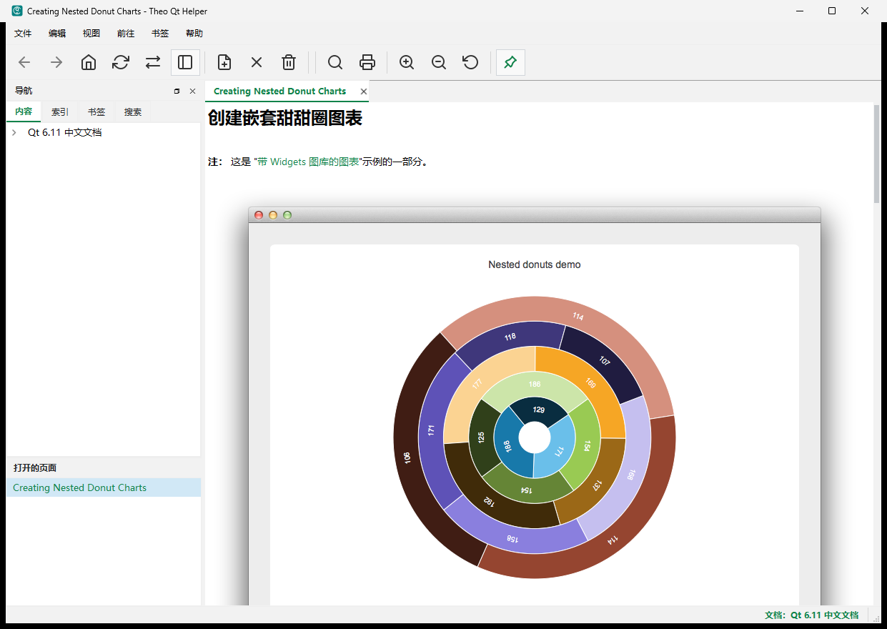

# Theo Qt Helper

[](https://github.com/theo0r1z/theo-qt-helper/actions/workflows/main.yml)
[](LICENSE)
[](https://github.com/theo0r1z/theo-qt-helper/releases)
[](#building-from-source)
[](https://www.qt.io/)
[](https://cmake.org/)

**English** 路 [涓枃璇存槑](#涓枃璇存槑)

Theo Qt Helper is a cross-platform desktop application for browsing **Qt 6 Simplified Chinese** API documentation offline. Built with Qt 6 and CMake, it provides an Assistant-style workflow: table of contents, index, full-text search, bookmarks, and a multi-pane tabbed layout for reading and comparing topics.

| | |
|---|---|
| **Repository** | https://github.com/theo0r1z/theo-qt-helper |
| **Prebuilt package** | Windows x64 only 鈥?[GitHub Releases](https://github.com/theo0r1z/theo-qt-helper/releases) |
| **Source in this repo** | Application source only (no bundled `.qch` help) |

## Screenshots



## Features

- Offline Qt Help (`.qch` / `.qhc`) with a Chinese UI
- Content tree, keyword index, full-text search, and bookmarks
- Multi-tab and multi-pane layouts with drag-and-drop split
- Index filter oriented toward classes and members
- Page zoom, print, always-on-top, and light/dark themes
- Session restore for open tabs and window layout

## Download (Windows x64)

1. Open [Releases](https://github.com/theo0r1z/theo-qt-helper/releases/latest).
2. Download `TheoQtHelper-<version>-win64-zh.zip`.
3. Extract the archive and run `TheoQtHelper.exe`.

The portable package includes the application, Qt runtime, and Qt 6.11 Simplified Chinese help under `docs/qt-6.11/qt-zh.qhc`. Windows 10/11 x64 is required; install `vc_redist.x64.exe` from the package if the app fails to start.

## Building from source

This project builds on **Windows**, **Linux**, and **macOS** with CMake and Qt 6.5+.

### Prerequisites

| Component | Version |
|-----------|---------|
| [Qt](https://www.qt.io/download) | 6.5+ 鈥?Widgets, Help, PrintSupport, Network, Svg |
| [CMake](https://cmake.org/) | 3.21+ |
| C++ toolchain | C++17 鈥?MSVC 2022, GCC 11+, or Clang 14+ |
| [Ninja](https://ninja-build.org/) | Recommended |

You must supply your own Qt Help collection (`.qch` / `.qhc`) or build one with Qt鈥檚 help tools. The Chinese documentation bundle in the Windows release is **not** part of this repository.

### Windows (MSVC)

```powershell
git clone https://github.com/theo0r1z/theo-qt-helper.git
cd theo-qt-helper

cmake -S . -B build -G Ninja `
  -DCMAKE_BUILD_TYPE=Release `
  -DCMAKE_PREFIX_PATH="D:\Qt\6.11.0\msvc2022_64"

cmake --build build
```

Output: `release\TheoQtHelper.exe`

### Linux

```bash
git clone https://github.com/theo0r1z/theo-qt-helper.git
cd theo-qt-helper

cmake -S . -B build -G Ninja \
  -DCMAKE_BUILD_TYPE=Release

cmake --build build
```

On Debian/Ubuntu, install development packages such as `qt6-base-dev`, `qt6-tools-dev`, `libqt6help6`, `libqt6svg6-dev`, and `libqt6printsupport6`.

Output: `release/TheoQtHelper`

### macOS

```bash
git clone https://github.com/theo0r1z/theo-qt-helper.git
cd theo-qt-helper

brew install qt@6 ninja cmake

cmake -S . -B build -G Ninja \
  -DCMAKE_BUILD_TYPE=Release \
  -DCMAKE_PREFIX_PATH="$(brew --prefix qt@6)"

cmake --build build
```

Output: `release/TheoQtHelper.app` (or `release/TheoQtHelper` depending on the generator)

### Continuous integration

Every push and pull request is built on Linux, Windows, and macOS via [GitHub Actions](.github/workflows/main.yml).

## Project layout

```
.github/workflows/   CI (Linux, Windows, macOS)
CMakeLists.txt       Build system
src/                 Application source
docs/screenshots/    README screenshots
docs/                Legal notice for bundled Qt docs (release package)
LICENSE              MIT license (application)
VERSION              Project version
```

## Qt documentation and trademarks

Qt庐, Qt Assistant庐, and related names are trademarks of The Qt Company Ltd. The Simplified Chinese documentation in the Windows release is derived from [doc.qt.io](https://doc.qt.io/qt-6/zh/) with technical corrections to API signatures only. See [docs/QT_DOC_NOTICE.md](docs/QT_DOC_NOTICE.md).

## License

Copyright 漏 2025 Theo Zhao. Released under the [MIT License](LICENSE).

## Author

**Theo Zhao** 鈥?[@theo0r1z](https://github.com/theo0r1z)

---

## 涓枃璇存槑

[English](#theo-qt-helper)

**Theo Qt Helper** 鏄竴娆捐法骞冲彴 **Qt 6 绠€浣撲腑鏂?API 鏂囨。** 绂荤嚎闃呰鍣紝鍩轰簬 Qt 6 涓?CMake 鏋勫缓銆傛彁渚涙帴杩?Qt Assistant 鐨勪娇鐢ㄤ綋楠岋細鐩綍銆佺储寮曘€佸叏鏂囨绱€佷功绛撅紝浠ュ強澶氬垎鏍忔爣绛鹃〉甯冨眬锛屼究浜庡鐓ч槄璇汇€?
| | |
|---|---|
| **浠撳簱** | https://github.com/theo0r1z/theo-qt-helper |
| **棰勭紪璇戝寘** | 浠?Windows x64 鈥?[GitHub Releases](https://github.com/theo0r1z/theo-qt-helper/releases) |
| **鏈粨搴撳唴瀹?* | 浠呭簲鐢ㄧ▼搴忔簮鐮侊紙涓嶅惈 `.qch` 鏂囨。鍖咃級 |

### 鐣岄潰鎴浘


### 鍔熻兘

- 绂荤嚎 Qt Help锛坄.qch` / `.qhc`锛夛紝涓枃鐣岄潰
- 鍐呭鏍戙€佸叧閿瓧绱㈠紩銆佸叏鏂囨悳绱€佷功绛?- 澶氭爣绛俱€佸鍒嗘爮锛屾敮鎸佹嫋鎷藉垎灞?- 闈㈠悜绫讳笌鎴愬憳鐨勭储寮曡繃婊?- 椤甸潰缂╂斁銆佹墦鍗般€佺獥鍙ｇ疆椤躲€佹祬鑹?娣辫壊涓婚
- 浼氳瘽鎭㈠锛堝凡鎵撳紑鏍囩涓庣獥鍙ｅ竷灞€锛?
### 涓嬭浇锛圵indows x64锛?
1. 鎵撳紑 [Releases](https://github.com/theo0r1z/theo-qt-helper/releases/latest)銆?2. 涓嬭浇 `TheoQtHelper-<version>-win64-zh.zip`銆?3. 瑙ｅ帇鍚庤繍琛?`TheoQtHelper.exe`銆?
渚挎惡鍖呭唴鍚▼搴忋€丵t 杩愯搴撳強 `docs/qt-6.11/qt-zh.qhc` 涓枃甯姪銆傞渶瑕?Windows 10/11 64 浣嶏紱鑻ユ棤娉曞惎鍔紝鍙繍琛屽寘鍐?`vc_redist.x64.exe`銆?
### 浠庢簮鐮佹瀯寤?
鏀寔鍦?**Windows**銆?*Linux**銆?*macOS** 涓婁娇鐢?CMake 涓?Qt 6.5+ 缂栬瘧銆?
#### 渚濊禆

| 缁勪欢 | 鐗堟湰 |
|------|------|
| [Qt](https://www.qt.io/download) | 6.5+ 鈥?Widgets銆丠elp銆丳rintSupport銆丯etwork銆丼vg |
| [CMake](https://cmake.org/) | 3.21+ |
| C++ 宸ュ叿閾?| C++17 鈥?MSVC 2022銆丟CC 11+ 鎴?Clang 14+ |
| [Ninja](https://ninja-build.org/) | 鎺ㄨ崘 |

闇€鑷鍑嗗 Qt Help 闆嗗悎锛坄.qch` / `.qhc`锛夈€俉indows Release 涓殑涓枃鏂囨。鍖?*涓嶅湪**鏈粨搴撳唴銆?
#### Windows锛圡SVC锛?
```powershell
git clone https://github.com/theo0r1z/theo-qt-helper.git
cd theo-qt-helper

cmake -S . -B build -G Ninja `
  -DCMAKE_BUILD_TYPE=Release `
  -DCMAKE_PREFIX_PATH="D:\Qt\6.11.0\msvc2022_64"

cmake --build build
```

杈撳嚭锛歚release\TheoQtHelper.exe`

#### Linux

```bash
git clone https://github.com/theo0r1z/theo-qt-helper.git
cd theo-qt-helper

cmake -S . -B build -G Ninja \
  -DCMAKE_BUILD_TYPE=Release

cmake --build build
```

Debian/Ubuntu 鍙畨瑁?`qt6-base-dev`銆乣qt6-tools-dev`銆乣libqt6help6`銆乣libqt6svg6-dev`銆乣libqt6printsupport6` 绛夊紑鍙戝寘銆?
杈撳嚭锛歚release/TheoQtHelper`

#### macOS

```bash
git clone https://github.com/theo0r1z/theo-qt-helper.git
cd theo-qt-helper

brew install qt@6 ninja cmake

cmake -S . -B build -G Ninja \
  -DCMAKE_BUILD_TYPE=Release \
  -DCMAKE_PREFIX_PATH="$(brew --prefix qt@6)"

cmake --build build
```

杈撳嚭锛歚release/TheoQtHelper.app`锛堟垨 `release/TheoQtHelper`锛?
#### 鎸佺画闆嗘垚

鎺ㄩ€佷笌 Pull Request 浼氬湪 Linux銆乄indows銆乵acOS 涓婇€氳繃 [GitHub Actions](.github/workflows/main.yml) 鑷姩鏋勫缓銆?
### 鐩綍缁撴瀯

```
.github/workflows/   CI锛圠inux / Windows / macOS锛?CMakeLists.txt       鏋勫缓绯荤粺
src/                 搴旂敤婧愮爜
docs/screenshots/    README 鎴浘
docs/                Release 涓枃鏂囨。娉曞緥璇存槑
LICENSE              搴旂敤 MIT 璁稿彲璇?VERSION              鐗堟湰鍙?```

### Qt 鏂囨。涓庡晢鏍?
Qt庐銆丵t Assistant庐 绛変负 The Qt Company Ltd. 鐨勫晢鏍囥€俉indows 鍙戣鍖呬腑鐨勭畝浣撲腑鏂囨枃妗ｆ潵婧愪簬 [doc.qt.io 涓枃鐗圿(https://doc.qt.io/qt-6/zh/)锛屼粎瀵?API 绛惧悕绛夋妧鏈粏鑺傚仛浜嗕慨姝ｃ€傝瑙?[docs/QT_DOC_NOTICE.md](docs/QT_DOC_NOTICE.md)銆?
### 璁稿彲璇?
Copyright 漏 2025 Theo Zhao銆傛湰椤圭洰閲囩敤 [MIT License](LICENSE)銆?
### 浣滆€?
**Theo Zhao** 鈥?[@theo0r1z](https://github.com/theo0r1z)