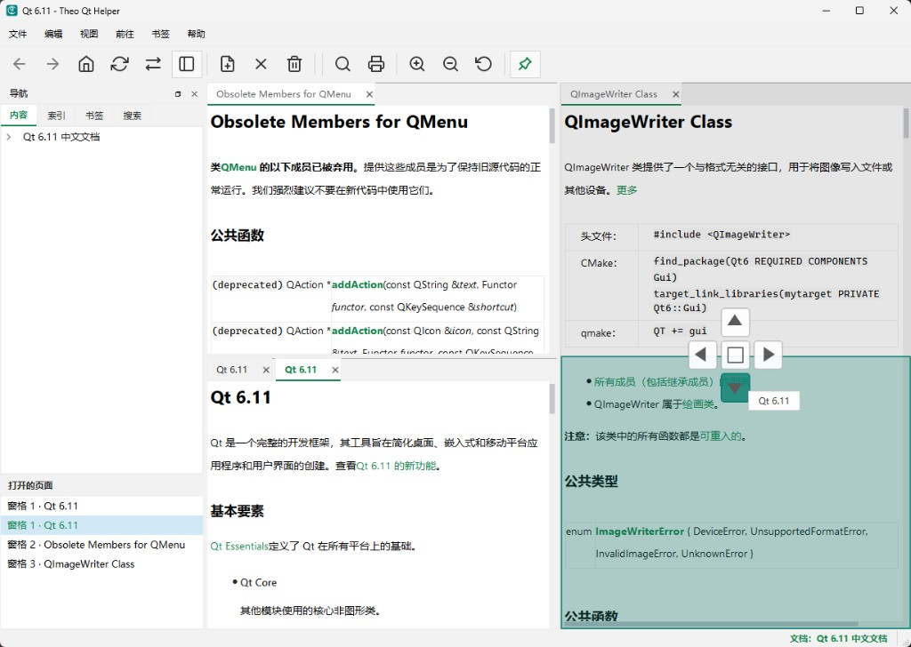
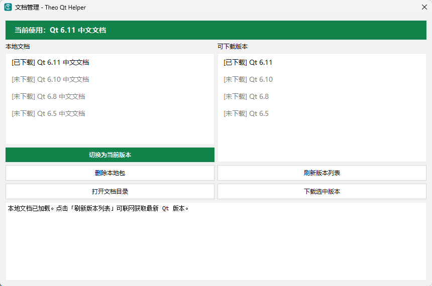
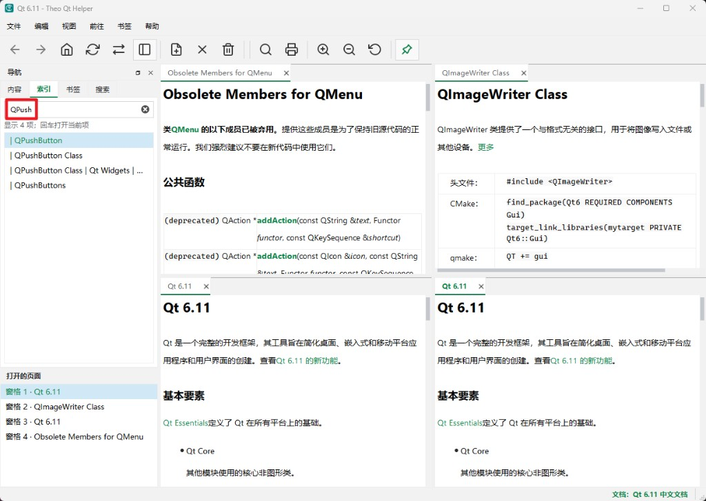

# Theo Qt Helper

[](https://github.com/theo0r1z/theo-qt-helper/actions/workflows/main.yml)
[](LICENSE)
[](https://github.com/theo0r1z/theo-qt-helper/releases)
[](#building-from-source)
[](https://www.qt.io/)
[](https://cmake.org/)

**English** · [中文说明](#中文说明)

**Theo Qt Helper** is an offline **Qt 6 Simplified Chinese API** documentation viewer — built for developers who read Qt docs every day. It goes beyond Qt Assistant with **multi-pane tiling**, **multi-version document management**, a **fast class-oriented index**, and **always-on-top** (pin the help window above your IDE — something native Qt Help / Assistant still lacks).

**Keywords:** Qt help documentation · Qt offline docs · Qt Chinese API docs · Qt Assistant alternative · `.qch` / `.qhc` viewer · 简体中文 Qt 文档

| | |
|---|---|
| **Repository** | https://github.com/theo0r1z/theo-qt-helper |
| **Prebuilt package** | Windows x64 only — [GitHub Releases](https://github.com/theo0r1z/theo-qt-helper/releases) |
| **Source in this repo** | Application source only (no bundled `.qch` help) |

## Highlights

### Multi-pane reading — compare docs side by side

Drag tabs to **split panes** (left / right / top / bottom). Open **multiple pages in multiple panes** at once — e.g. overview + class reference + obsolete members — without leaving the app. The **Open pages** list tracks every tab in every pane.



### Document management — multiple Qt versions in one app

Install, switch, and remove **Qt Chinese help collections** (6.5 / 6.8 / 6.10 / 6.11 …). Refresh the online version list, download a new `.qch` bundle, or delete local packages to save disk space — then **switch the active collection in one click**.



### Smart index — find classes and members instantly

The **index** tab is tuned for API lookup: type a prefix like `QPush` and jump to `QPushButton`, members, and related entries. Filtering focuses on **classes and members** (not noise from every HTML page). **Ctrl+I** focuses the index; ambiguous keywords show a pick list.



### Always on top — keep docs above your IDE

**Qt Assistant and the built-in help viewer do not offer a reliable “stay on top” mode.** Theo Qt Helper adds a one-click **pin** (toolbar or View menu → **Stay on top**): the help window stays above Qt Creator, Visual Studio, or any editor while you code. The setting is **remembered** across sessions.

### More features

| Category | Details |
|----------|---------|
| **Navigation** | Content tree, bookmarks, full-text search, back/forward history |
| **Appearance** | **Light / dark** themes (View → Theme), page zoom, **always-on-top (pin)** |
| **Productivity** | Sync table of contents with the current page, in-page find, print |
| **Layout** | Per-pane tabs, session restore (panes + tabs + window geometry) |
| **Input** | Mouse back/forward buttons (when focus is in the app) |
| **Platform** | Windows (prebuilt), Linux and macOS from source |

## Screenshots

| Multi-pane | Document manager | Index |
|:---:|:---:|:---:|
|  |  |  |

## Download (Windows x64)

1. Open [Releases](https://github.com/theo0r1z/theo-qt-helper/releases/latest).
2. Download `TheoQtHelper-<version>-win64-zh.zip`.
3. Extract the archive and run `TheoQtHelper.exe`.

The portable package includes the application, Qt runtime, and Qt 6.11 Simplified Chinese help under `docs/qt-6.11/qt-zh.qhc`. Windows 10/11 x64 is required; install `vc_redist.x64.exe` from the package if the app fails to start.

## Building from source

This project builds on **Windows**, **Linux**, and **macOS** with CMake and Qt 6.5+.

### Prerequisites

| Component | Version |
|-----------|---------|
| [Qt](https://www.qt.io/download) | 6.5+ — Widgets, Help, PrintSupport, Network, Svg |
| [CMake](https://cmake.org/) | 3.21+ |
| C++ toolchain | C++17 — MSVC 2022, GCC 11+, or Clang 14+ |
| [Ninja](https://ninja-build.org/) | Recommended |

You must supply your own Qt Help collection (`.qch` / `.qhc`) or build one with Qt's help tools. The Chinese documentation bundle in the Windows release is **not** part of this repository.

### Windows (MSVC)

```powershell
git clone https://github.com/theo0r1z/theo-qt-helper.git
cd theo-qt-helper

cmake -S . -B build -G Ninja `
  -DCMAKE_BUILD_TYPE=Release `
  -DCMAKE_PREFIX_PATH="D:\Qt\6.11.0\msvc2022_64"

cmake --build build
```

Output: `release\TheoQtHelper.exe`

### Linux

```bash
git clone https://github.com/theo0r1z/theo-qt-helper.git
cd theo-qt-helper

cmake -S . -B build -G Ninja \
  -DCMAKE_BUILD_TYPE=Release

cmake --build build
```

On Debian/Ubuntu, install development packages such as `qt6-base-dev`, `qt6-tools-dev`, `libqt6help6`, `libqt6svg6-dev`, `libqt6printsupport6`, and `libcups2-dev`.

Output: `release/TheoQtHelper`

### macOS

```bash
git clone https://github.com/theo0r1z/theo-qt-helper.git
cd theo-qt-helper

brew install qt ninja cmake

cmake -S . -B build -G Ninja \
  -DCMAKE_BUILD_TYPE=Release \
  -DCMAKE_PREFIX_PATH="$(brew --prefix qt)"

cmake --build build
```

Output: `release/TheoQtHelper.app` (or `release/TheoQtHelper` depending on the generator)

### Continuous integration

Every push and pull request is built on Linux, Windows, and macOS via [GitHub Actions](.github/workflows/main.yml).

## Project layout

```
.github/workflows/   CI (Linux, Windows, macOS)
CMakeLists.txt       Build system
src/                 Application source
docs/screenshots/    README screenshots
docs/                Legal notice for bundled Qt docs (release package)
LICENSE              MIT license (application)
VERSION              Project version
```

## Qt documentation and trademarks

Qt®, Qt Assistant®, and related names are trademarks of The Qt Company Ltd. The Simplified Chinese documentation in the Windows release is derived from [doc.qt.io](https://doc.qt.io/qt-6/zh/) with technical corrections to API signatures only. See [docs/QT_DOC_NOTICE.md](docs/QT_DOC_NOTICE.md).

## License

Copyright © 2025 Theo Zhao. Released under the [MIT License](LICENSE).

## Author

**Theo Zhao** — [@theo0r1z](https://github.com/theo0r1z)

---

## 中文说明

[English](#theo-qt-helper)

**Theo Qt Helper** 是一款 **Qt 6 简体中文 API 文档** 离线阅读器，面向日常查文档的 Qt 开发者。相比 Qt Assistant，它的核心是：**文档多分屏并排阅读**、**多版本文档管理**、**面向类与成员的高速索引**，以及 **窗口置顶**（边写代码边查文档——这是 Qt 原生帮助最缺的能力）。

**关键词：** Qt 帮助文档 · Qt 中文帮助文档 · Qt 离线文档 · Qt 中文 API · Qt Assistant 替代 · `.qch` / `.qhc` 阅读器

| | |
|---|---|
| **仓库** | https://github.com/theo0r1z/theo-qt-helper |
| **预编译包** | 仅 Windows x64 — [GitHub Releases](https://github.com/theo0r1z/theo-qt-helper/releases) |
| **本仓库内容** | 仅应用程序源码（不含 `.qch` 文档包） |

### 核心亮点

#### 多分屏并排阅读 — 对照查文档

标签页可 **拖拽分屏**（左 / 右 / 上 / 下），同时打开多个窗格、多个页面，例如总览 + 类参考 + 废弃成员对照查看。**打开的页面** 列表会列出每个窗格里的全部标签，一键切换。


#### 文档管理 — 多版本 Qt 中文帮助一站切换

在应用内 **安装、切换、删除** 各版本 Qt 中文文档（6.5 / 6.8 / 6.10 / 6.11 …）。可联网刷新官方版本列表、下载新 `.qch` 包，或删除本地包释放空间，**一键切换当前文档集**。


#### 智能索引 — 类名、成员名秒搜

**索引** 页针对 API 查阅优化：输入 `QPush` 即可筛到 `QPushButton` 及成员等条目，过滤侧重 **类与成员**，减少无关页面干扰。**Ctrl+I** 快速聚焦索引；关键字对应多页时会弹出选择列表。


#### 窗口置顶 — Qt 原生帮助最缺的能力

**Qt Assistant 与 IDE 内置帮助没有好用的「总在最前」模式。** Theo Qt Helper 提供一键 **窗口置顶**（工具栏图钉或 视图 → **窗口置顶**）：文档窗口始终浮在 Qt Creator、Visual Studio 等编辑器之上，边编码边查 API。置顶状态会 **自动保存**，下次启动仍然生效。

### 更多功能

| 类别 | 说明 |
|------|------|
| **导航** | 内容树、书签、全文搜索、前进/后退历史 |
| **外观** | **浅色 / 深色** 主题（视图 → 主题）、页面缩放、**窗口置顶** |
| **效率** | 目录与当前页同步、页内查找、打印 |
| **布局** | 每窗格多标签、会话恢复（窗格 + 标签 + 窗口位置） |
| **输入** | 鼠标侧键后退/前进（焦点在本应用内时） |
| **平台** | Windows 预编译包；Linux / macOS 可从源码构建 |

### 界面截图

| 多分屏 | 文档管理 | 索引 |
|:---:|:---:|:---:|
|  |  |  |

### 下载（Windows x64）

1. 打开 [Releases](https://github.com/theo0r1z/theo-qt-helper/releases/latest)。
2. 下载 `TheoQtHelper-<version>-win64-zh.zip`。
3. 解压后运行 `TheoQtHelper.exe`。

便携包内含程序、Qt 运行库及 `docs/qt-6.11/qt-zh.qhc` 中文帮助。需要 Windows 10/11 64 位；若无法启动，可运行包内 `vc_redist.x64.exe`。

### 从源码构建

支持在 **Windows**、**Linux**、**macOS** 上使用 CMake 与 Qt 6.5+ 编译。

#### 依赖

| 组件 | 版本 |
|------|------|
| [Qt](https://www.qt.io/download) | 6.5+ — Widgets、Help、PrintSupport、Network、Svg |
| [CMake](https://cmake.org/) | 3.21+ |
| C++ 工具链 | C++17 — MSVC 2022、GCC 11+ 或 Clang 14+ |
| [Ninja](https://ninja-build.org/) | 推荐 |

需自行准备 Qt Help 集合（`.qch` / `.qhc`）。Windows Release 中的中文文档包 **不在** 本仓库内。

#### Windows（MSVC）

```powershell
git clone https://github.com/theo0r1z/theo-qt-helper.git
cd theo-qt-helper

cmake -S . -B build -G Ninja `
  -DCMAKE_BUILD_TYPE=Release `
  -DCMAKE_PREFIX_PATH="D:\Qt\6.11.0\msvc2022_64"

cmake --build build
```

输出：`release\TheoQtHelper.exe`

#### Linux

```bash
git clone https://github.com/theo0r1z/theo-qt-helper.git
cd theo-qt-helper

cmake -S . -B build -G Ninja \
  -DCMAKE_BUILD_TYPE=Release

cmake --build build
```

Debian/Ubuntu 可安装 `qt6-base-dev`、`qt6-tools-dev`、`libqt6help6`、`libqt6svg6-dev`、`libqt6printsupport6`、`libcups2-dev` 等开发包。

输出：`release/TheoQtHelper`

#### macOS

```bash
git clone https://github.com/theo0r1z/theo-qt-helper.git
cd theo-qt-helper

brew install qt ninja cmake

cmake -S . -B build -G Ninja \
  -DCMAKE_BUILD_TYPE=Release \
  -DCMAKE_PREFIX_PATH="$(brew --prefix qt)"

cmake --build build
```

输出：`release/TheoQtHelper.app`（或 `release/TheoQtHelper`）

#### 持续集成

推送与 Pull Request 会在 Linux、Windows、macOS 上通过 [GitHub Actions](.github/workflows/main.yml) 自动构建。

### 目录结构

```
.github/workflows/   CI（Linux / Windows / macOS）
CMakeLists.txt       构建系统
src/                 应用源码
docs/screenshots/    README 截图
docs/                Release 中文文档法律说明
LICENSE              应用 MIT 许可证
VERSION              版本号
```

### Qt 文档与商标

Qt®、Qt Assistant® 等为 The Qt Company Ltd. 的商标。Windows 发行包中的简体中文文档来源于 [doc.qt.io 中文版](https://doc.qt.io/qt-6/zh/)，仅对 API 签名等技术细节做了修正。详见 [docs/QT_DOC_NOTICE.md](docs/QT_DOC_NOTICE.md)。

### 许可证

Copyright © 2025 Theo Zhao。本项目采用 [MIT License](LICENSE)。

### 作者

**Theo Zhao** — [@theo0r1z](https://github.com/theo0r1z)
